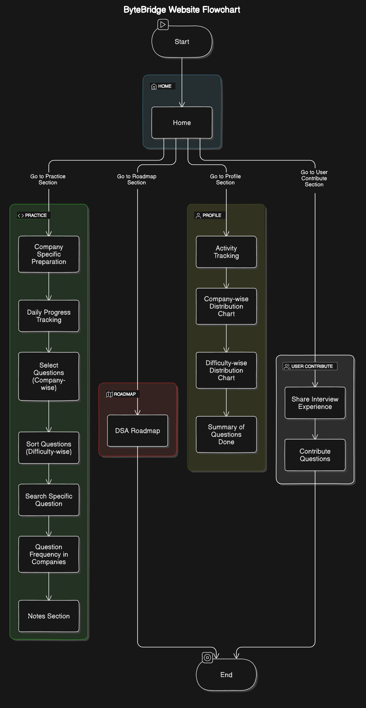

# ByteBridge: Your Ultimate DSA Companion 🚀

## Table of Contents
1. [Overview](#overview)
2. [Features](#features)
3. [How It Works](#how-it-works)
4. [Getting Started](#getting-started)
   - [Prerequisites](#prerequisites)
   - [Installation](#installation)
5. [Usage Guide](#usage-guide)
   - [Home Page](#home-page)
   - [Practice Section](#practice-section)
   - [Roadmap Section](#roadmap-section)
   - [User Profile](#user-profile)
   - [User Contribute](#user-contribute)
6. [Tech Stack](#tech-stack)
7. [Contact & Support](#contact--support)
10. [Acknowledgements](#acknowledgements)
11. [FAQs](#faqs)

## Overview

Welcome to ByteBridge - your all-in-one platform for mastering Data Structures and Algorithms (DSA)! 🎉

ByteBridge isn't just another coding practice website; it's a comprehensive ecosystem designed to transform your DSA journey. Whether you're preparing for technical interviews at top tech companies or aiming to strengthen your problem-solving skills, ByteBridge has got you covered.

With its intuitive interface, personalized learning paths, and company-specific content, ByteBridge bridges the gap between learning and mastery. Dive into a world where algorithms come to life, data structures become your second nature, and coding challenges turn into exciting puzzles waiting to be solved.

Are you ready to embark on this exciting journey? Let's byte into the bridge to your successful tech career! 💻🌉

## Features

ByteBridge is packed with features to supercharge your DSA learning:

### 🏠 Home Page
- Your central hub for navigating the ByteBridge universe
- Quick access to all sections and latest updates

### 💪 Practice Section
- **Company-specific Preparation**: Tailored problem sets from top tech companies
- **Progress Tracking**: Monitor your daily achievements and long-term growth
- **Smart Question Selection**: Choose questions by company, difficulty, or topic
- **Advanced Search**: Find that specific question you're looking for
- **Frequency Meter**: See how often a question appears in real interviews
- **Personal Notes**: Attach your thoughts and approaches to each problem

### 🗺️ Roadmap Section
- Structured learning paths for DSA mastery
- From "Array Novice" to "Algorithm Guru" - follow your personalized journey

### 👤 User Profile Section
- **Activity Dashboard**: Visualize your coding journey
- **Distribution Charts**: 
  - See your strength across different companies
  - Analyze your performance across difficulty levels
- **Achievement Tracker**: Celebrate your milestones and completed challenges

### 🤝 User Contribute Section

- **Question Contribution**: Add new problems and respective company faced in interviews 


## How It Works

Behold, the architectural marvel of ByteBridge!



This flowchart illustrates the intricate web of ByteBridge's functionality. From the moment you land on the Home page, you're connected to a network of learning opportunities. Each section is carefully crafted to enhance your DSA mastery journey.

## Getting Started

### Prerequisites
- Node.js (v14.0.0 or later)
- npm (v6.0.0 or later)
- A passion for coding and problem-solving! 🧠💡

### Installation

1. Clone the ByteBridge repository:
   ```bash
   git clone https://github.com/Harshitkukreja31/ByteBridge
   ```

2. Navigate to the project directory:
   ```bash
   cd ByteBridge
   ```

3. Install the dependencies:
   ```bash
   npm install
   ```

4. Start the ByteBridge server:
   ```bash
   npm run
   ```

5. Open your favorite browser and visit `http://localhost:3000`. Welcome to ByteBridge!

## Usage Guide

### Home Page
Your Company-Specific DSA preparation journey begins here. 

### Practice Section
1. Choose a company or topic you want to focus on.
2. Select questions based on difficulty or frequency.
3. Solve problems, submit your solutions, and track your progress.
4. Use the notes feature to document your approach and learnings.

### Roadmap Section

Follow the customized learning path.


### User Profile
1. Track your consistency.
2. Analyze your performance charts.
3. Check your previous solved questions.

### User Contribute
1. Share your recent interview experience.
2. Submit new questions you encountered and respective company.


## Tech Stack

ByteBridge is built with a powerful yet lightweight tech stack:

- **HTML5**: For structuring our content
- **CSS3**: For styling and responsiveness
- **JavaScript (ES6+)**: For interactive functionality
- **LocalStorage**: For data persistence
- **Chart.js**: For beautiful, responsive charts


## Contact & Support

Got questions? Ideas? Just want to chat? We're here for you!

- 📧 Email: harshitkukreja07@gmail.com


## Acknowledgements

ByteBridge stands on the shoulders of the giants. We'd like to thank:

- [GitHub](https://github.com/krishnadey30/LeetCode-Questions-CompanyWise) for their Company-wise DSA quetions CSV files.
- [LeetCode](https://leetcode.com/) for inspiration on problem formats


---

Ready to revolutionize your DSA learning journey? Dive into ByteBridge now and start bridging the gap to your dream tech career! 🌟

Remember, in the world of ByteBridge, every problem solved is a step towards greatness. Happy coding! 🚀👨‍💻👩‍💻
